#Haswell平台安装OS X Mountain Lion指南
##一、前言


##二、测试机主要硬件
配件名			| 		型号 				| 	备注
:----------- 	| :-----------				| :-----------
主板				| MSI H87M-G43        		| UEFI使用PMPatch处理过，并加入了SLIC2.2
CPU				| Intel i5 4570        		| 
内存         	| Kingston HyperX DDR3 1600 4G x 2        | 
显卡         	| 昂达典范GTX650 1G 纯公版	| 
网卡				| Realtek 8111g        		| 板载
声卡				| ALC892        			| 板载
硬盘         	| 希捷Barracuda 1T       	| 系统安装测试用
固态硬盘#1      	| OCZ Agility 3 60G       	| 安装Windows 7 64位版，使用联想证书激活
固态硬盘#2   	| Kingston V300 120G       	| 安装Mac OS X 10.8.5
蓝牙     		| 未知品牌，未知型号USB蓝牙适配器	| 芯片是BCM的，免驱，支持Magic trackpad
无线网卡     	| BCM4322        			| 使用mini pci-e转pci-e转接卡
无线键鼠			| 罗技MK240					| 音量快捷键有效

##三、BIOS设置
> 如果和本人的主板一样，可以使用本人修改过的BIOS（加了SLIC证书，破解了电源管理），下载地址：<http://pan.baidu.com/share/link?shareid=3767318220&uk=1594821192>，其它主板就别刷了，会黑屏的


* 设置好Sata，开启AHCI，热插拔
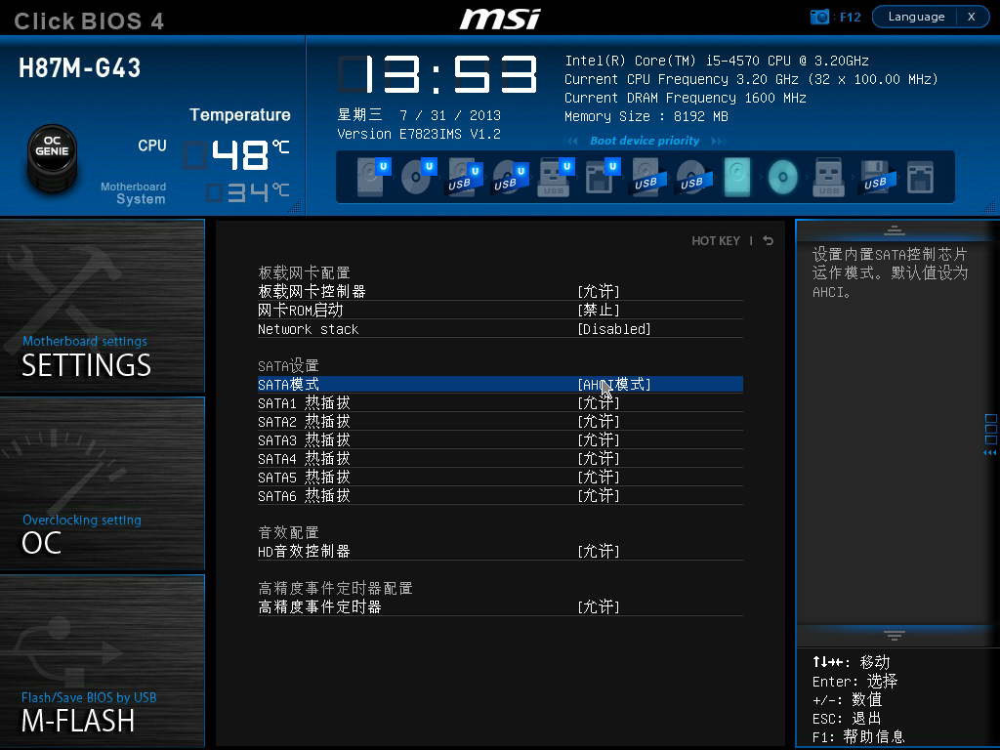
* 如果不打算使用核显，关闭核显

* 如果打算使用核显，请打开核显
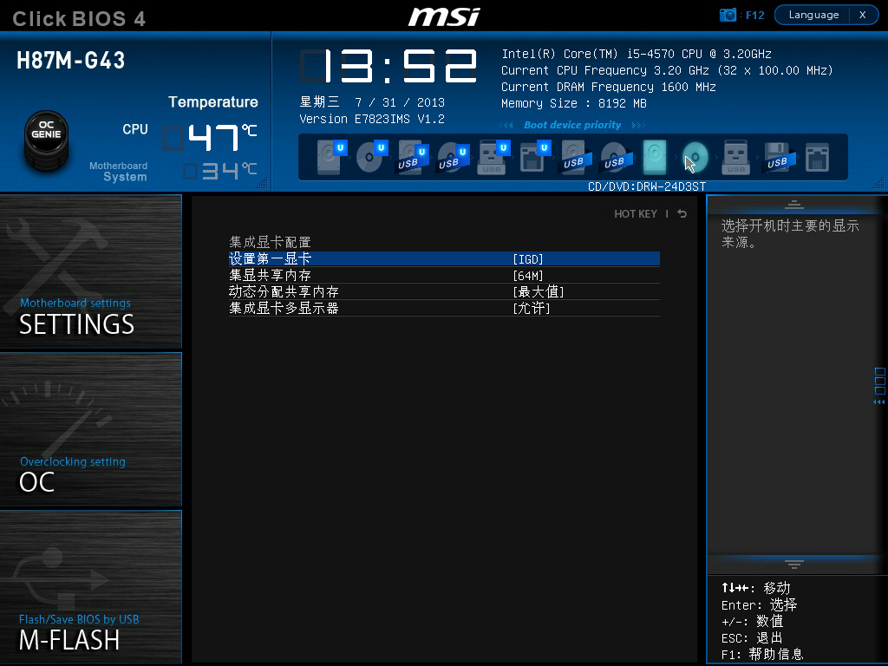
* 开启legacy boot支持
忘了截图了，默认是开启了的

##四、制作安装U盘
> 不管采用何种方法制作安装U盘，请特别注意如下几点：
> 
> 	1. 合适的bootloader及其配置文件
> 	2. 必要的驱动
> 	3. 重要的启动参数
> 	4. 合适的内核(mach_kernel)
> 	5. MBR分区安装，还要破解OSInstall

###1. Windows制作安装U盘

请先自行参考如下帖子制作安装U盘，有时间再把这把这部分补上：

<http://bbs.pcbeta.com/viewthread-1048611-1-1.html>

<http://bbs.pcbeta.com/viewthread-1326392-1-1.html>

<http://bbs.pcbeta.com/viewthread-979177-1-1.html>

但要注意3点：

1. 替换变色龙boot文件及配置文件
2. 使用本人提供的FakeSMC
3. 使用本人提供的mach_kernel

###2. Mac下制作安装U盘

> 本人向来都是使用原版镜像自行制作安装U盘，如果各位喜欢懒人版，请注意前面提到那几个注意点。
>
> Bootloader其实也可以选择其它的，如Clover等，但相对别的引导器，我对变色龙更熟悉些，因此，选择变色龙作为引导器


####2.1 资料准备
#####2.1.1 Mac OS X 10.8.4 12E55 原版镜像  
下载地址: <http://pan.baidu.com/share/link?shareid=1065507335&uk=1594821192>
#####2.1.2 Mac OS X 10.8.5内核  
下载地址: <http://pan.baidu.com/share/link?shareid=3391131496&uk=1594821192>
#####2.1.3 变色龙：
下载地址: <http://bbs.pcbeta.com/viewthread-1379934-1-1.html>
####2.1.4 其它
下载地址: <http://pan.baidu.com/share/link?shareid=3407839550&uk=1594821192>

内部资料说明：

资料名								 		| 备注
:----------- 								| :-----------
FakeSMC.kext								| 非常重要，只要是黑苹果都需要它
IOAHCIBlockStorageInjector.kext				| 解决内置硬盘橙色问题
NullCPUPowerManagement.kext					| 禁用Intel电源管理
RealtekRTL8111.kext							| Realtek网卡驱动
AppleIntelE1000e.kext						| Intel网卡的驱动
OpenHaltRestart.kext						| 重启补丁，变色龙已经修正重启问题，一般不需要添加
Extra										| 变色龙配置模板+机型设定模型，可以不修改就直接用
OSInstall(MBR)+OSInstall.mpkg(10.8.4)		| OSInstall破解


####2.2 参考步骤
#####2.2.1 U盘分区与格式化 
>这里会丢失U盘里全部资料，操作前请做好备份
 
安装U盘的容量最少为8G，如果是16G或更大容量的U盘，可以分为多个分区，只要保证有一个分区空间不小于8G

打开硬盘工具(位置在`/Applications/Utilities`，即 `/应用程序/实用工具`)，按下图操作
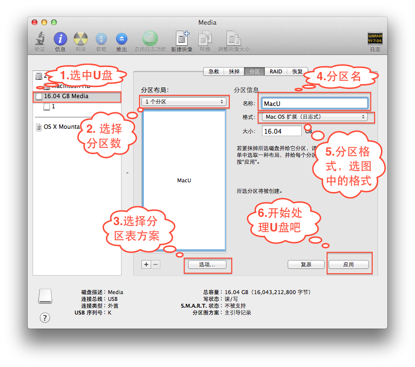

#####2.2.2 挂载InstallESD.dmg  
InstallESD.dmg的位置： ` "Install OS X Mountain Lion.app"/Contents/SharedSupport `
如果是下载前面提供的10.8.4原版镜像，则可以使用下图方法找到InstallESD.dmg：
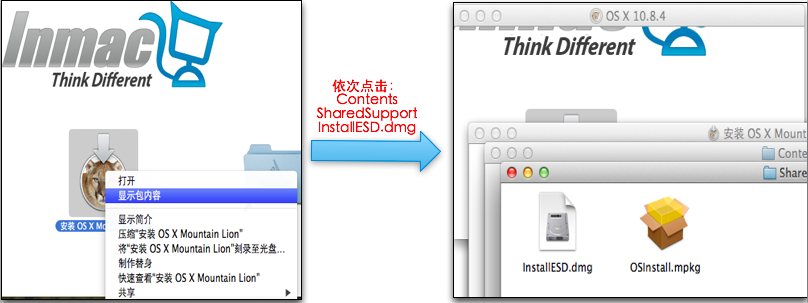
找到后点击InstallESD.dmg即可挂载，一般会挂载到 `/Volumes/Mac OS X Install ESD`

#####2.2.3 挂载BaseSystem.dmg  
BaseSystem.dmg的位置 `/Volumes/Mac OS X Install ESD`，

>
>BaseSystem.dmg是一个隐藏文件，如果想在Finder中看到它，则需要修改一个Finder的默认设置，使用终端执行如下命令：
>
>```
>defaults write com.apple.finder AppleShowAllFiles -bool true
>```
>然后重启一下Finder或注销再登录即可查看隐藏文件
>

找到并点击BaseSystem.dmg即可挂载，一般会挂载到 `/Volumes/Mac OS X Base System`

>我个人喜欢用终端找开隐藏文件，使用终端命令如下
>
```
cd /Volumes/ 					#
ls								#确认一下InstallESD的挂载点，其实使用也可以使用df命令确认挂载点
cd "Mac OS X Install ESD"		#
open BaseSystem.dmg				#挂载 
```
>

#####2.2.4 恢复BaseSystem.dmg到U盘分区

还是使用磁盘工具，按下图操作：
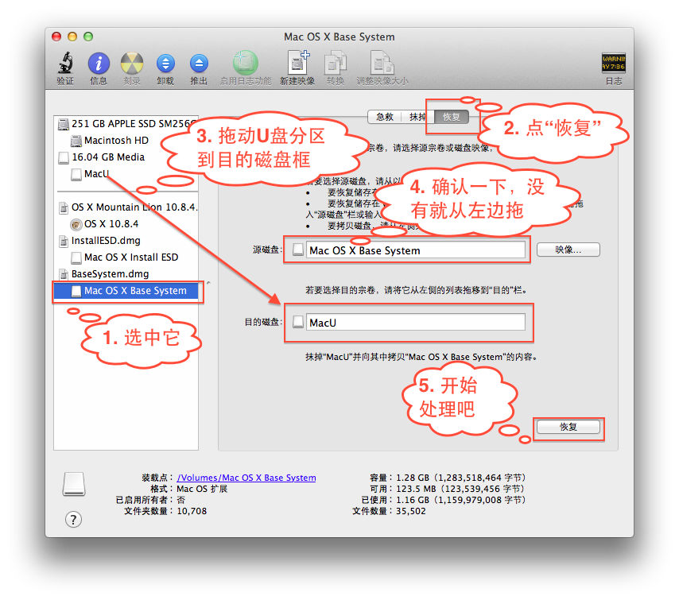

操作完之后, 最好把BaseSystem.dmg给卸载了，如下图所示，以避免名字上的干扰：
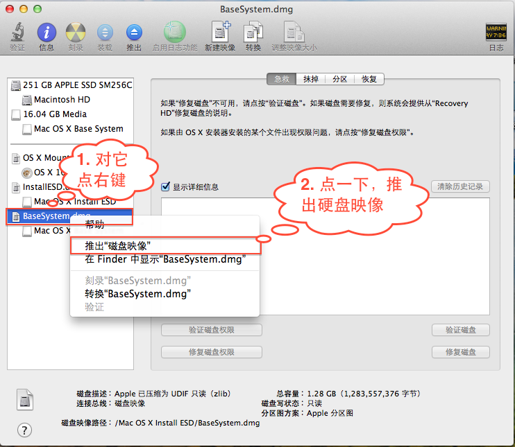

恢复BaseSystem.dmg后U盘分区名也变成了`Mac OS X Base System`，建议改一下名字，如`Mac OS X 10.8.4 U Installer`，直接使用Finder找到U盘分区，直接改就行了。所有挂载了的硬盘（含U盘）分区都在`/Volumes`下可以找到。其实可以改安装U盘图标的，这个根安装过程没什么关系，就不多说了。

#####2.2.5 复制Packages
1. 删除`/Volumes/Mac OS X 10.8.4 U Installer/System/Installation` 下的 Packages
2. 复制`/Volumes/Mac OS X Install ESD/Packages` 到 `/Volumes/Mac OS X 10.8.4 U Installer/System/Installation`
	
#####2.2.6 替换mach_kernel （* **很重要**）
把附件中mach_kernel放到U盘分区根目录下  
注：mach_kernel可在附件2.1.2中找到

#####2.2.7 安装变色龙 （* **很重要**）
打开变色龙安装包，到如下图的时候，注意要选择安装U盘分区，如下图所示
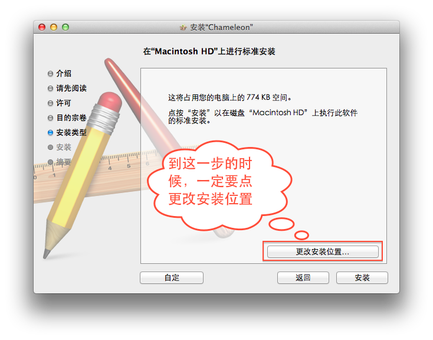
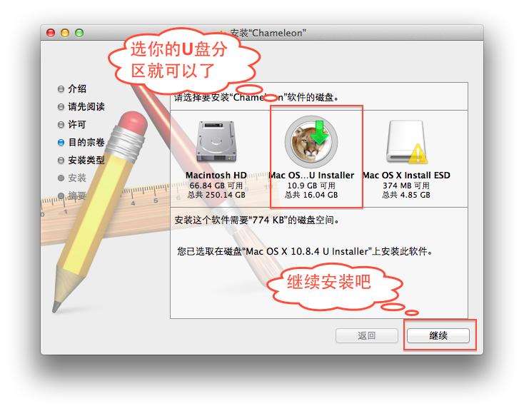
注：强烈建议使用本人的专用变色龙（附件2.1.2），或者是最新变色龙

#####2.2.8 安装Kext （* **很重要**）
把下表中你**需要**的kext文件复制到 `U盘分区/System/Library/Extensions` 下

Kext名			| 		必需 				| 	备注
:----------- 	| :-----------				| :-----------
FakeSMC.kext	| 是							| 非常重要，只要是黑苹果都需要它
IOAHCIBlockStorageInjector.kext		| 否		| 解决内置硬盘橙色问题，建议装上
NullCPUPowerManagement.kext			| 否		| 如果是你的UEFI使用PMPatch处理过，或是主板支持Mac原生电源管理，则不添加，否则请添加
RealtekRTL8111.kext					| 否		| Realtek网卡驱动，有Realtek网卡并且想在安装的时候使用网络，则添加
AppleIntelE1000e.kext				| 否		| Intel网卡的驱动，有Intel网卡并且想在安装的时候使用网络，则添加
OpenHaltRestart.kext				| 否		| 重启补丁，变色龙已经修正重启问题，一般不需要添加

注：这些东西可以在附件2.1.4中找到，自行先下载

#####2.2.9 添加Extra下面的文件 （* **很重要**）

把附件2.1.4中的Extra复制到U盘根目录下

#####2.2.10 破解OSInstall(***安装到MBR分区必须**)

使用附件中的OSInstall.mpkg替换 

	U盘分区/System/Installation/Packages/OSInstall.mpkg 

使用附件中的OSInstall替换 

	U盘分区/System/Library/PrivateFrameworks/Install.framework/Frameworks/OSInstall.framework/Versions/A/OSInstall

##五、安装系统
> 前言

###参考步骤
####1. 使用U盘引导
重启，按`F11`选择启动项，记得要选安装U盘，如下图所示，大家的名字可能会不一样，注意一下就行了
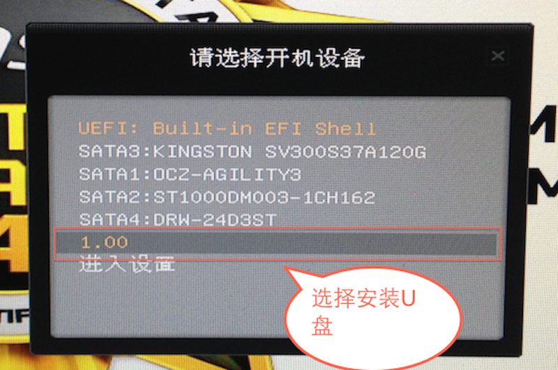
如果之前给U盘成功安装了变色龙，则就启动安装U盘了：
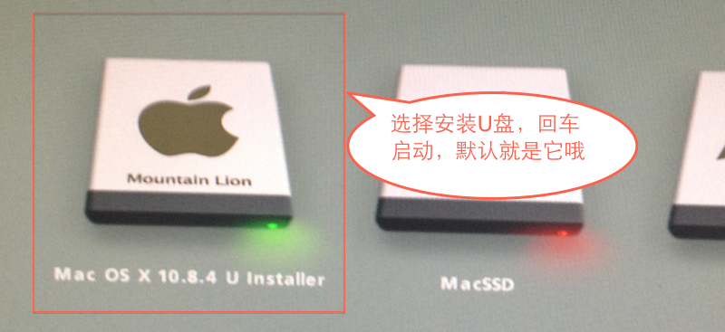
####2. 选择安装过程中的语言
如果能到这一步，说明离成功已经很近了，恭喜！记得要选中文，当然，你E文好的话，选E文我也没意见。
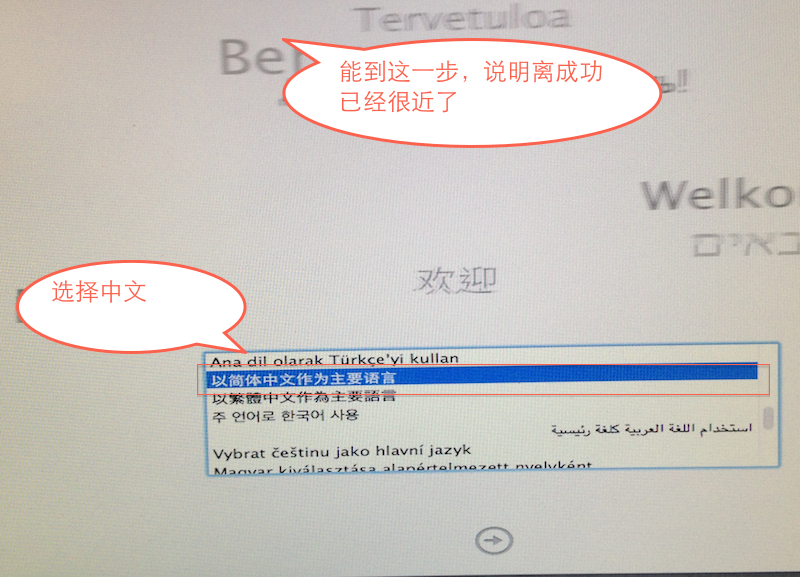
接下来直接下一步，下一步就行了，没什么可说的，但到下面步骤时注意下。
####3. 准备安装分区
到这里时，先别急着选分区安装，当然如果之前已经经准备好一个安装分区并且格式化也是对的，那就选那个分区开始安装吧，否则点击`实用工具->磁盘工具`准备一个安装分区吧
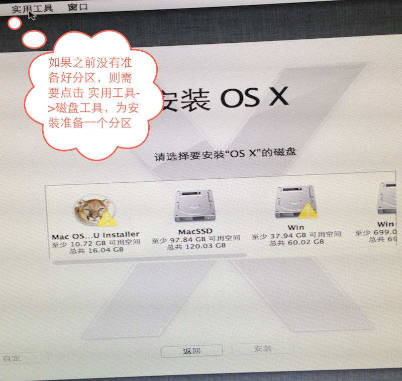
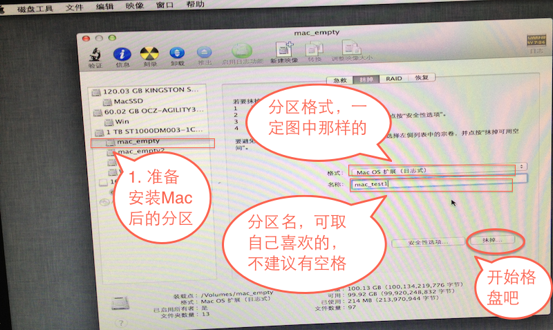
准备好了分区之后，就可以退出磁盘工具，开始安装了
####4. 选择安装分区，开始安装
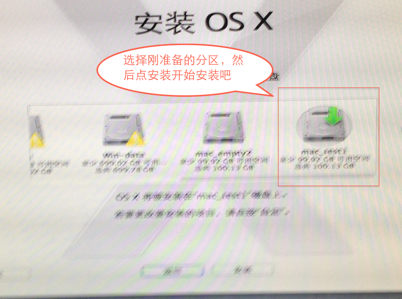
####5. 安装成功后，复制必要文件
大概10来分钟，系统就可以安装好，这时不要重启（重启了你也进不了系统）
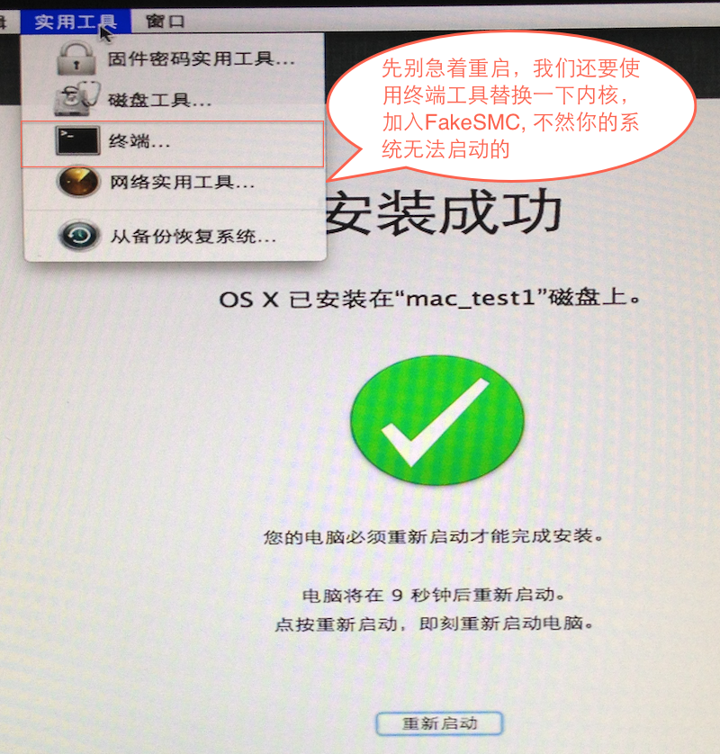
打开 `实用工具->终端`，替换mach_kernel、复制FakeSMC、复制其它驱动、复制Extra配置文件
	
	#这里有个小技巧，全手工敲路径是件很累的事，大家可以尝试按Tab键盘自动补全
	#“#“后面的是注释，不用输的，另外，如果名字有空格，可以使用双引号把名字括起来，或是在空格前\进行转义
	
	#进入/Volumes，查看一下挂载的了分区，确认一下，mac安装分区名字
	#这一步必须要做
	cd /Volumes/
	ls
	
	#进入到mac安装分区，特别注意下，注意，这里不要照抄
	#根据你的实际分区进行修改，我的是mac_test1，你的可能不一样哦，
	#另外，如前所述，如果名字有空格，则使用双引号把名字括起来，或是在空格前加\进行转义
	#这一步必须要做
	cd mac_test1
	
	#复制U盘里的mach_kernel到mac安装分区
	#这一步必须要做
	cp /mach_kernel .
	
	#复制FakeSMC，千万注意后面的 System前面没有/
	#这一步必须要做
	cp -a /System/Library/Extensions/FakeSMC.kext System/Library/Extensions/
	
	#复制其它驱动，如果你之前给U盘添加了话，就执行一下，没有就算了，
	#另外，主板不支持原生电源管理的话，建议把NullCPUPowerManagement.kext也复制一份
	#这一步可选
	cp -a /System/Library/Extensions/RealtekRTL8111.kext System/Library/Extensions/
	cp -a /System/Library/Extensions/IOAHCIBlockStorageInjector.kext System/Library/Extensions/
	cp -a /System/Library/Extensions/NullCPUPowerManagement.kext System/Library/Extensions/ #可能不需要，我的主板刷BIOS就不需要了
	
	#修复一下权限
	#这一步必须要做
	chown -R root:wheel System/Library/Extensions/
	chmod -R 755 System/Library/Extensions/
	touch System/Library/Extensions/
	
	#复制一下Extra配置文件
	#这一步必须要做
	cp -a /Extra .
	
下面是我操作时的图片，需要注意下，中间有个地方敲错了，已经标出来了
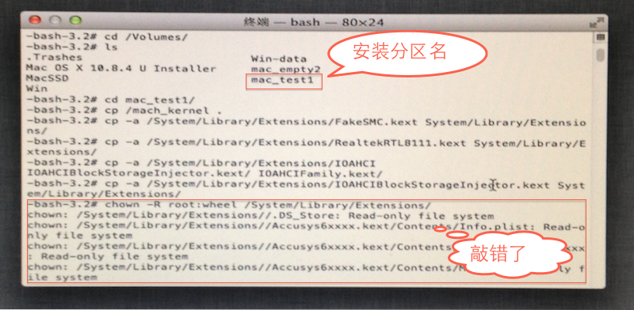
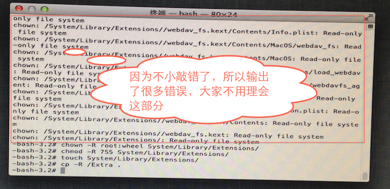

####6. 退出终端，重启

##六、安装后配置
###首次启动
还是使用安装U盘引导，但选择启动Mac分区
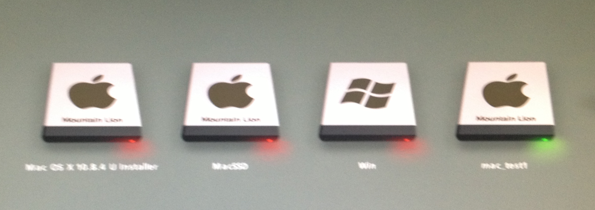
接下来，就可以启动mac分区了，如果前面步骤没出错，应该可以进系统了，按照屏幕提示就行了。

###安装变色龙
如果想驱动核显，请安装专版变色龙，如果不需要驱动核显，则安装其它变色龙也可以。
如果是1T或更大的硬盘，可以会安装失败，请参考<http://bbs.pcbeta.com/viewthread-971434-1-1.html>中的手动安装方法解决

###安装10.8.5更新
12F30下载地址：<http://pan.baidu.com/share/link?shareid=319645471&uk=1594821192>
下载完后，点击SXUpdCombo10.8.5_12F30Seed.pkg安装

###开启Trim
打开终端，执行如下命令
	
	sudo perl -pi -e 's|(\x52\x6F\x74\x61\x74\x69\x6F\x6E\x61\x6C\x00{1,20})[^\x00]{9}(\x00{1,20}\x54)|$1\x00\x00\x00\x00\x00\x00\x00\x00\x00$2|sg' /System/Library/Extensions/IOAHCIFamily.kext/Contents/PlugIns/IOAHCIBlockStorage.kext/Contents/MacOS/IOAHCIBlockStorage
	sudo touch /System/Library/Extensions/

重启

##七、核显驱动

先参考

<http://bbs.pcbeta.com/viewthread-1379934-1-1.html>

<http://bbs.pcbeta.com/viewthread-1379618-1-1.html>

##八、独显驱动
###Nvidia
6xx系列、7xx系列几乎全部免驱，建议不加GraphicsEnabler变色龙参数，启动试试，不行再搜索论坛吧
###ATI
6xxxx系列大部分，7xxxx大部分一般免驱，建议不加GraphicsEnabler变色龙参数，启动试试，不行再搜索论坛吧

##九、网卡驱动

###1. Realtek
附件中有提供

###2. Intel
附件中有提供

##十、声卡驱动
###1. Realtek 8xx
####1.1 使用Multibeast
下载地址：<http://pan.baidu.com/share/link?shareid=1004206354&uk=1594821192>

####1.2 使用VoodooHDA
如果Multibeast不行，请尝试VoodooHDA2.8.4  
下载地址：<http://pan.baidu.com/share/link?shareid=986235878&uk=1594821192>

####1.3 自行仿冒
MSI H87M-G43 上的仿冒驱动：<http://pan.baidu.com/share/link?shareid=816314451&uk=1594821192>
###2. 其它
自行搜索解决

##十一、常见问题

###Q1 一堆SMC错误，无法正常进系统，但能进安全模式
加dart=0启动参数

###Q2. 启动时卡在Waiting for DSMOS
加入SystemID   
参考：  
<http://bbs.pcbeta.com/forum.php?mod=viewthread&tid=966538>  
<http://i.pcbeta.com/blog-1651940-2561.html>

##十二、问题反馈
在如下地址回帖：<http://bbs.pcbeta.com/viewthread-1380908-1-1.html>

##十三、成功案例

###Hale(就是本人了)
10.8.4 10.8.5 10.9都已经安装成功了

###lipenggang537
<http://bbs.pcbeta.com/forum.php?mod=viewthread&tid=1380908&page=5#pid36855617>
<http://bbs.pcbeta.com/viewthread-1382392-1-1.html>

###siegyu
<http://bbs.pcbeta.com/viewthread-1380543-1-1.html>